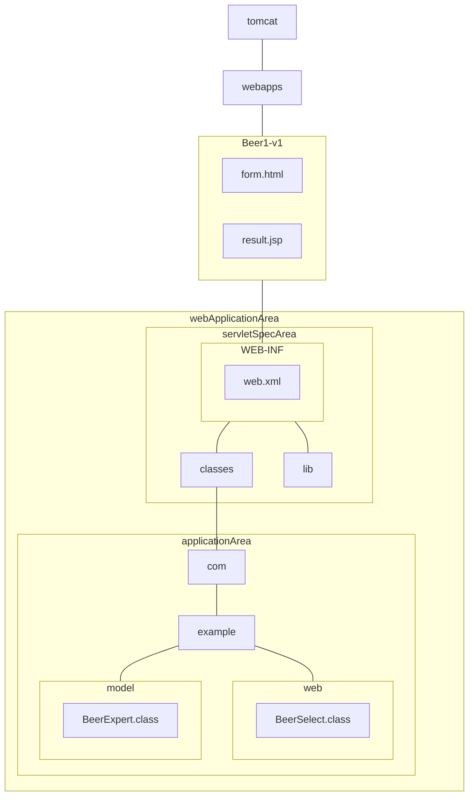

# Ch3 초간단 미니 MVC

## 톰캣 구조

## 구조 설명

### tomcat
톰캣 홈 디렉토리이다. 실제 이름은 `apache-tomcat-8.5.99` 이다. 뒤 버전은 다운로드 받은 버전에 따라 다를 수 있다.

### Beer-v1
웹 애플리케이션의 이름이다.

이 부분을 보통 '컨텍스트 홈 디렉토리' 라고 부른다. 톰캣이 URL을 분석할 때 사용하는 홈이다.

### webApplicationArea
웹 애플리케이션 영역이다. 이 부분은 어떤 컨테이너를 사용하든지 동일한 구조를 따른다.

### web.xml
이 파일은 반드시 WEB-INF 디렉토리에 있어야 한다.

### com
여기 있는 패키지 구조는 개발 환경에서 사용한 것과 동일하다. JAR 파일로 배포하지 않는다면, WEB-INF/classes 디렉토리 밑에 패키지 디렉토리 구조를 만들어야 한다. 