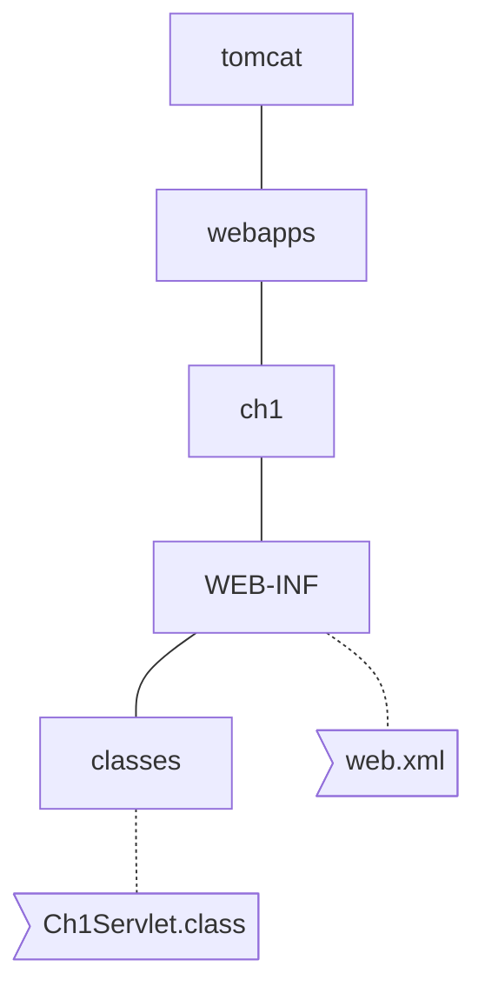

# test 폴더
해당 내용은 챕터 1의 내용

## 톰캣 폴더의 구조를 아래와 같이 만든다.

## 작성한 자바 파일을 아래 명령어로 컴파일한다.
```zsh
javac -classpath /your_tomcat_path/tomcat/lib/servlet-api.jar -d classes src/Ch1Servlet.java
```

## Ch1Servlet.class 파일을 WEB-INF/classes 디렉토리로 복사한다. 그 다음 web.xml 파일을 WEB-INF 디렉토리에 복사한다.

## 톰캣 디렉토리에서 톰캣을 실행한다.

```zsh
bin/startup.sh
```

## 브라우저에 아래 주소를 입력한다.

```zsh
http://localhost:8080/ch1/Serv1
```
